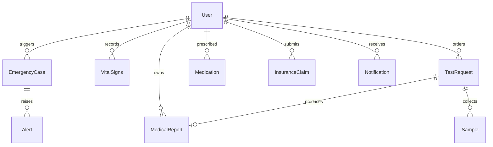

# Database Schemas & Entity Relationships

This document outlines the entity relationships and data dictionaries for MediLink AI.

## Entity Details

### 1. User (`models/User.js`)
* `name`: String, required.
* `email`: String, unique index, normalized.
* `password`: String, bcrypt hashed with minimum 10 rounds.
* `role`: Enum `['patient', 'doctor', 'admin', 'lab', 'pharmacy', 'insurance', 'emergency', 'hospital']`.
* `emergencyContacts`: Array of subdocuments:
  * `name`, `relationship`, `phone`, `email`, `priority` (`Primary`, `Secondary`), `isPrimary` (Boolean).
* `assignedDoctor`: ObjectId ref to `User`.
* `age`, `gender`, `bloodGroup`, `phone`, `address`.

### 2. EmergencyCase (`models/EmergencyCase.js`)
* `emergencyId`: Auto-generated unique format (`EMG-XXXX`).
* `patientId`: ObjectId ref to `User`.
* `status`: Enum `['ACTIVE', 'ACKNOWLEDGED', 'TEAM_ASSIGNED', 'EN_ROUTE', 'ARRIVED', 'UNDER_CARE', 'RESOLVED', 'CANCELLED']`.
* `priority`: Enum `['Critical', 'Warning', 'Info']`.
* `location`: Object `{ latitude, longitude, accuracy, address, source }`.
* `assignedDoctor`: ObjectId ref to `User`.
* `assignedEmergencyTeam`: Object `{ teamId, teamName, unitType, vehicleNumber, phone }`.
* `timeline`: Array of status change events `{ status, timestamp, updatedBy, note }`.
* `alertsSent`: Audit logs of sent SMS/Push/In-App alerts.

### 3. MedicalReport (`models/MedicalReport.js`)
* `reportId`: Unique String.
* `patientId`: ObjectId ref to `User`.
* `doctorId`: ObjectId ref to `User`.
* `category`: Enum `['Laboratory', 'Radiology', 'Cardiology', 'Neurology', 'Pathology', 'Diagnostic', 'Clinical']`.
* `fileFormat`: Enum `['pdf', 'dcm', 'nii', 'csv', 'png', 'jpg', 'jpeg', 'edf', 'xml', 'tiff', 'tif', 'docx', 'json']`.
* `reportStatus`: Enum `['Draft', 'Final', 'Amended', 'Published']`.
* `criticalStatus`: Enum `['Normal', 'Abnormal', 'Critical']`.
* `structuredResults`: Key-value pairs with reference ranges.
* `aiAnalysis`: Summary, abnormalities, risk score.
